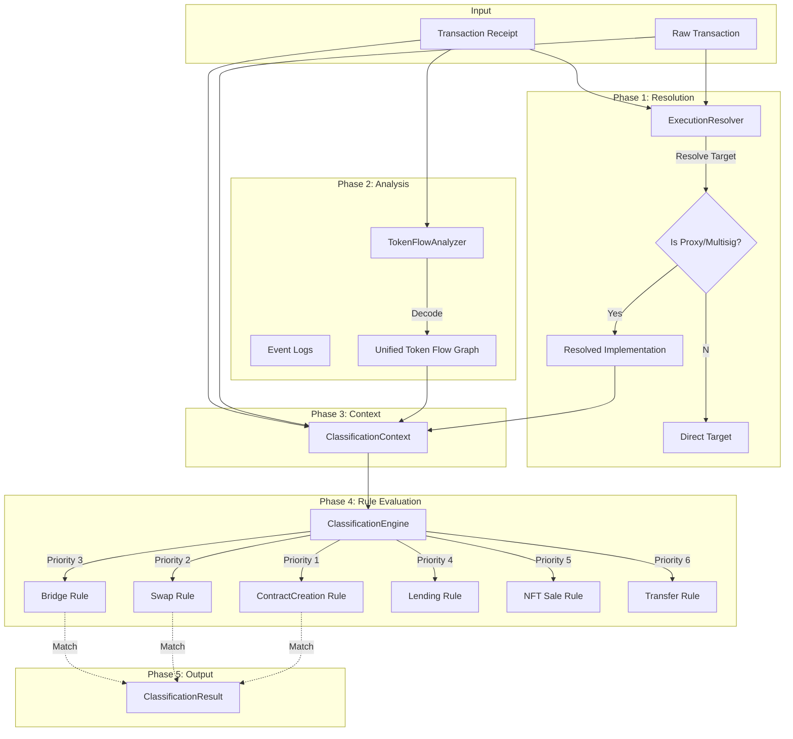

# Enterprise Reporting & Chain Receipt Semantic Classifier

## Overview
This document outlines the interpretation, guarantees, and technical architecture of the Chain Receipt Enterprise PDF Reports and the underlying **Chain Receipt Semantic Classifier**.

---

## Part 1: Report Standards

### 1. Classification Methodology
Our reports utilize a **Deterministic Semantic Classifier** rather than simple ABI matching. This means we analyze the *intent* of the transaction (e.g., "Yield Farming", "Governance Vote") rather than just the method name.

### 2. Confidence Levels
Every classification includes a confidence score based on multiple signals (Flow, Events, Selectors, Address lists).

| Label | Score | Meaning |
|-------|-------|---------|
| **Confirmed** | ≥ 85% | Multi-signal match (e.g., Known Contract + Correct Event + Verified Token Flow). |
| **High Confidence** | 70-84% | Strong signal (e.g., Known Bridge Address) but missing secondary confirmation. |
| **Likely** | 55-69% | Probabilistic match based on behavior patterns (e.g., Looks like a Swap). |
| **Complex** | < 55% | Ambiguous transaction. We decline specific labeling to avoid misleading users. |

### 3. Report Structure

#### Primary Action
The single most significant intent of the transaction. Even if a transaction does multiple things (e.g., Approve + Swap), we highlight the *outcome* (Swap).

#### Secondary Actions
Additional detected behaviors are listed under "Also involved". This ensures complex interactions (e.g., Auto-compounding which involves Claim + Swap + Stake) are fully represented.

#### Execution Type
We distinguish *how* the transaction was executed:
- **Direct**: Standard EOA Key signature.
- **Smart Account**: ERC-4337 Account Abstraction user op.
- **Multisig**: Gnosis Safe or similar threshold signatures.
- **Proxy**: Execution via a relayer or forwarder.

### 4. Risk & Safety
The report automatically flags potential risks:
- **Contract Creation**: Deployment of new code.
- **Low Confidence**: Explicit warning when heuristics are weak.
- **Approvals**: (Future) Flagging unlimited token allowances.

### 5. Guarantees
- **Determinism**: The same transaction hash will always generate the exact same report layout and classification ID.
- **Privacy**: No user data is stored on-chain. Reports are generated locally or in ephemeral environments.

---

## Part 2: Technical Architecture (The Engine)

### 1. Overview
The **Chain Receipt Semantic Classifier** (formerly "Me Classifier") is the core component responsible for identifying the **semantic intent** of a blockchain transaction.

It is "Deterministic" because it follows a strict, repeatable pipeline:
1.  **Resolution**: Determines *who* executed *what* (handling Proxies/Multisigs).
2.  **Analysis**: Maps *all* asset flows (Native, ERC20, NFT).
3.  **Evaluation**: Checks against a prioritized set of Rules.
4.  **Result**: Returns the **first** rule that matches with high confidence.

### 2. Architecture Diagram



### 3. Top-Level File Structure
The engine is located in `apps/api/src/services/classifier`:

```text
apps/api/src/services/classifier/
├── TransactionClassifier.ts  # Public Entry Point
├── core/
├── infrastructure/
└── rules/                    # Specific Logic
```

### 4. The 5-Phase Execution Pipeline

#### Phase 1: Normalization & Execution Resolution
**File:** `infrastructure/ExecutionResolver.ts`
Before looking at *what* the transaction did, the engine figures out *who* did it.
*   **Direct Calls**: Standard interactions.
*   **Proxies (EIP-1967)**: Detects `Upgraded` events to find the true implementation.
*   **Multisigs (Gnosis Safe)**: Detects `ExecutionSuccess` to identify multisig transactions.

#### Phase 2: Log Decoding & Token Flow
**File:** `infrastructure/TokenFlow.ts`
The engine builds a **Unified Token Flow Graph**. It iterates through all logs and internal transfers to map:
*   **Who sent what?** (Native ETH, ERC20, ERC721)
*   **Who received what?**
This simplifies complex DeFi rules. Instead of parsing logs manually, a rule just asks: *"Did the user send Token A and receive Token B?"*

#### Phase 3: Context Assembly
**File:** `core/Context.ts`
All data (Tx, Receipt, Flow, Chain Info) is frozen into a `ClassificationContext`. This ensures every rule sees the exact same state and prevents side effects.

#### Phase 4: Rule Evaluation (The Deterministic Part)
**File:** `core/Engine.ts`
The Engine iterates through specific `ClassificationRules` in a **Strict Priority Order**.
*   **Priority 100**: Contract Creation (Most specific)
*   **Priority 90**: Swaps (DEX)
*   **Priority 80**: Bridges
*   **Priority 70**: Lending
*   **Priority 60**: NFT Sales
*   **Priority 10**: Generic Transfers

**Logic:**
1.  **`Rule.matches(ctx)`**: Fast check. Does this look like a Swap? (e.g., Are there Swap topic hashes?)
2.  **`Rule.classify(ctx)`**: Deep check. Calculate confidence.
3.  **First Valid Match Wins**: The moment a rule returns a result, the engine stops.

#### Phase 5: Result Delivery
**File:** `core/Engine.ts`
Returns a `ClassificationResult` containing:
*   **Functional Type**: e.g., `SWAP`, `NFT_SALE`, `LENDING_DEPOSIT`.
*   **Confidence**: 0.0 to 1.0 (High confidence matches are preferred).
*   **Protocol**: e.g., "Uniswap V2", "Aave".
*   **Execution Type**: `DIRECT`, `RELAYED` (Proxy), or `MULTISIG`.
